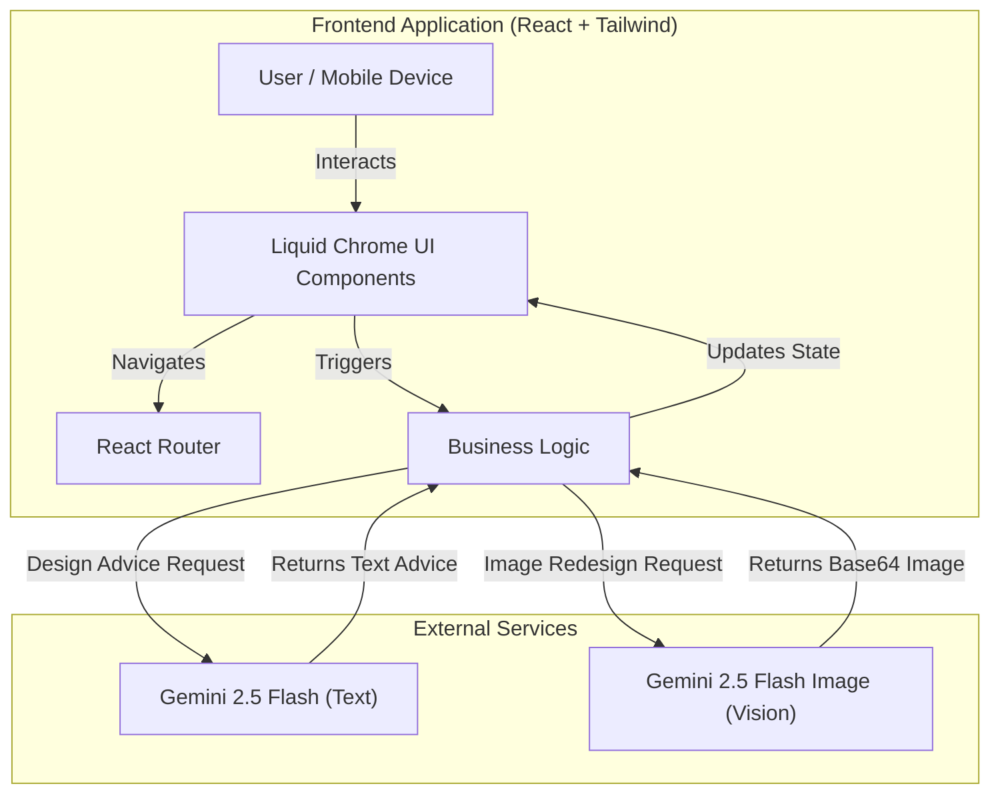

# HomeVisualizer 🏠✨

**HomeVisualizer** is a mobile-first, AI-powered interior design application designed to simulate a high-end native iOS experience on the web. It leverages Google's **Gemini 2.5 Flash** models to transform room photos into redesigned spaces based on specific architectural styles or text prompts.

The application features a distinct **"Liquid Chrome" aesthetic**, utilizing glassmorphism, neon accents, and fluid animations to create a futuristic user interface.

---

## 🚀 Use Cases

1.  **Homeowners & Renters**: Instantly visualize how a living room would look in a "Cyberpunk" or "Minimalist" style before buying furniture.
2.  **Interior Designers**: Rapidly prototype concepts for clients using the "Edit" feature (e.g., "Add a velvet rug").
3.  **Real Estate Agents**: Virtual staging for empty properties to showcase potential to buyers.

---

## 🏗 Architecture

The application is built as a Single Page Application (SPA) using **React 19**. It communicates directly with the Google Gemini API for generative tasks. State management is handled locally within components, and user profile data is persisted via LocalStorage.

### Architecture Diagram

---

## 🛠 Tech Stack

*   **Core Framework**: React 19 (via ESM imports)
*   **Styling**: Tailwind CSS + Custom CSS for "Liquid Chrome" effects (backdrops, gradients, animations).
*   **Routing**: React Router DOM v6/v7.
*   **AI Engine**: Google GenAI SDK (`@google/genai`).
*   **Icons**: Lucide React.
*   **Build/Runtime**: Browser-native ES Modules (no build step required for this specific setup).

---

## ✨ Key Features

### 1. Liquid Chrome UI System
A custom design system built from scratch in `index.html` and `App.tsx`.
*   **Glassmorphism**: Heavy use of `backdrop-filter: blur()` to create depth.
*   **Mobile Simulation**: Wraps the app in a container that mimics a mobile device viewport with a dynamic notch and rounded corners on desktop screens.
*   **Animations**: CSS keyframes for `liquid-pulse`, `neon-blob` movements, and page transitions.

### 2. AI Room Redesign (`Designer.tsx`)
The core feature of the app.
*   **Style Transfer**: Uses `gemini-2.5-flash-image` to take a user's photo and redesign it while maintaining the structural layout (perspective, walls, floor).
*   **Generative Editing**: Users can type specific commands (e.g., "Add a plant in the corner") to modify specific parts of the image using the `edit` mode.

### 3. Comparison Slider
Located in the Designer view, this custom component allows users to interactively drag a handle to compare the **Original** photo vs. the **Redesigned** AI output in real-time.

### 4. Intelligent Design Advice (`ProductDetails.tsx`)
When viewing specific products, the app calls `gemini-2.5-flash` to generate context-aware design advice (e.g., "How to style this industrial sofa") based on the simulated room context.

### 5. Theatrical Processing (`Processing.tsx`)
A simulated "neural engine" loading screen that enhances the user experience by providing visual feedback (terminal logs, progress bars) while the user transitions between uploading and designing.

---

## 📂 Project Structure

| File | Description |
| :--- | :--- |
| `index.html` | Entry point. Contains global CSS for the "Liquid Chrome" theme and import maps. |
| `App.tsx` | Main layout shell. Handles the "Mobile Container" simulation and routing. |
| `services/geminiService.ts` | **Crucial**. Handles API calls to Google Gemini for text and image generation. |
| `pages/Designer.tsx` | The workspace where users view images, apply styles, and use the comparison slider. |
| `pages/Upload.tsx` | Interface for selecting camera or gallery inputs. |
| `pages/Profile.tsx` | User profile management with LocalStorage persistence. |

---

## 🚀 How to Run

1.  **API Key**: Ensure a valid Google Gemini API key is available in the environment variables as `process.env.API_KEY`.
2.  **Serve**: Since this uses ES Modules directly in the browser, serve the root directory using a static file server (e.g., `npx serve`, Python `http.server`, or VS Code Live Server).
3.  **Access**: Open `index.html` in a modern browser.

---

## 🤖 API Usage Details

The app uses two specific models:

1.  **`gemini-2.5-flash-image`**:
    *   Used for: `redesignRoom` function.
    *   Input: Text Prompt + Base64 Image.
    *   Output: Redesigned Base64 Image.

2.  **`gemini-2.5-flash`**:
    *   Used for: `getDesignAdvice` function.
    *   Input: Text Prompt.
    *   Output: Text bullets.